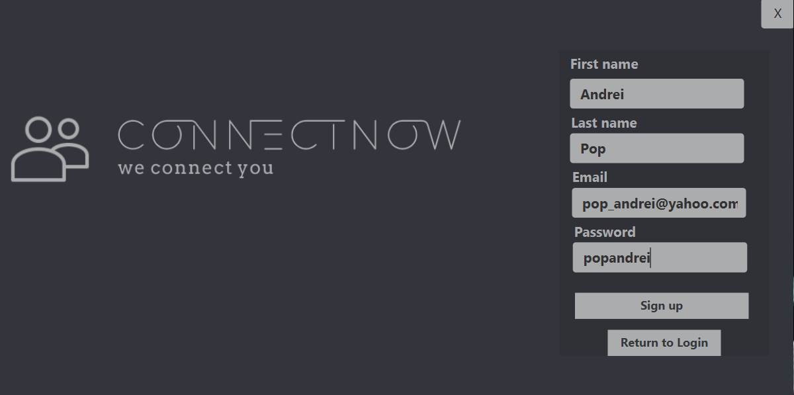

# ConnectNow - Aplicatie de Social Network
## Obiective
Crearea unei retele sociale. Utilizatorii vor putea sa isi creeze propriile lor conturi, sa isi trimita cereri de prietenie
si in cele din urma sa poata sa vorbeasca cu prietenii lor. Acestia pot crea eventuri la care sa participe si alti utilizatori prieteni cu creatorul eventului, fiind notificati zilnic toti participantii. Utilizatorii vor putea sa vizualizeze diferite rapoarte legate despre activitatea lor pe care si le vor putea exporta in cele din urma pe calculator sub forma de PDF.

## Partea tehnica
Este o aplicatie dezvoltata in Java, folosind drept baza de date PostgreSQL. Pentru interfata grafica a fost folosit JavaFX. Fiind predispusa la un volum mare de date, aplicatia pagineaza informatiile din baza de date, incarcandu-se noi pagini la fiecare scroll in liste.

## Flow
La pornirea aplicatiei, utilizatorul va fi nevoit fie sa se logheze, fie sa isi creeze un cont nou.

 

Dupa ce utilizatorul se autentifica cu succes, acesta poate naviga pe mai multe taburi si anume:

- Show Friends - aici utilizatorul poate sa vada eventurile la care participa si urmeaza sa se apropie, sa isi vada lista de prieteni, si sa isi stearga prietenii

- Add Friend - aici utilizatorul poate sa caute alti utilizatori si sa ii adauge ca prieteni.

- Show Requests - unde utilizatorul poate sa accepte cereri de prietene venite de la alte persoane, sau sa isi vada cererile proprii care inca nu au fost acceptate.

- Chat Room - unde utilizatorul poate sa isi trimita mesaje cu ceilalti prieteni ai sai.

- Reports - unde utilizatorul poate sa isi genereze rapoarte despre activitatea sa pe cont pe care sa si le poata exporta pe calculator sub forma de PDF.

- Events - unde utilizatorul poate sa creeze eventuri la care pot participa si prietenii sai, de asemenea acesta este notificat de eventurile care urmeaza zilnic, de fiecare data cand intra in cont.

